# KeralaGO — PostgreSQL Database Schema ERD

This document provides the complete Entity Relationship Diagram (ERD) and relational schema for the **KeralaGO Taxi Booking Platform MVP**.

---

## 1. Entity Relationship Diagram (Mermaid)

```mermaid
erDiagram
    %% ACCOUNTS DOMAIN
    User ||--o| UserProfile : "has profile"
    User ||--o{ EmergencyContact : "has contacts"
    User ||--o| DriverProfile : "operates as driver"
    User ||--o{ Ride : "books as customer"
    User ||--o{ Review : "writes review"
    User ||--o{ Review : "receives review"
    User ||--o{ SOSAlert : "triggers SOS"
    User ||--o{ SupportTicket : "opens ticket"
    User ||--o{ SupportTicketMessage : "sends message"

    User {
        uuid id PK
        varchar mobile_number UK
        varchar full_name
        varchar role "USER | DRIVER | ADMIN"
        boolean is_active
        boolean is_staff
        timestamp created_at
        timestamp updated_at
    }

    OTPChallenge {
        uuid id PK
        varchar mobile_number
        varchar purpose "LOGIN | REGISTRATION | PHONE_CHANGE"
        varchar code_hash
        timestamp expires_at
        timestamp consumed_at
        int attempt_count
        int max_attempts
    }

    UserProfile {
        uuid id PK
        uuid user_id FK,UK
        varchar profile_photo
        varchar default_payment_method
        timestamp created_at
    }

    EmergencyContact {
        uuid id PK
        uuid user_id FK
        varchar name
        varchar mobile_number
        varchar relationship
        boolean is_primary
    }

    %% DRIVERS DOMAIN
    DriverProfile ||--o| DriverCurrentLocation : "current GPS"
    DriverProfile ||--o{ DriverDocument : "kyc documents"
    DriverProfile ||--o{ Vehicle : "registered vehicles"
    DriverProfile ||--o{ DriverLedgerEntry : "ledger entries"
    DriverProfile ||--o{ Payout : "receives payouts"

    DriverProfile {
        uuid id PK
        uuid user_id FK,UK
        varchar license_number UK
        varchar approval_status "PENDING | APPROVED | REJECTED"
        uuid approved_by_id FK
        boolean is_online
        timestamp approved_at
    }

    DriverCurrentLocation {
        uuid id PK
        uuid driver_id FK,UK
        decimal latitude
        decimal longitude
        decimal accuracy_meters
        timestamp recorded_at
    }

    DriverDocument {
        uuid id PK
        uuid driver_id FK
        varchar document_type "DRIVING_LICENSE | RC | INSURANCE | IDENTITY"
        varchar document_number
        varchar file_url
        varchar review_status "PENDING | APPROVED | REJECTED"
        uuid reviewed_by_id FK
        boolean is_current
        text rejection_reason
    }

    %% VEHICLES DOMAIN
    VehicleCategory ||--o{ Vehicle : "categorizes"
    VehicleCategory ||--o{ FareConfig : "pricing config"
    VehicleCategory ||--o{ Ride : "requested category"

    VehicleCategory {
        uuid id PK
        varchar name
        varchar code UK
        int capacity
        boolean is_active
    }

    Vehicle ||--o{ Ride : "assigned vehicle"
    Vehicle {
        uuid id PK
        uuid driver_id FK
        uuid category_id FK
        varchar registration_number UK
        varchar make
        varchar model
        int manufacture_year
        int capacity
        boolean is_active
    }

    %% PRICING DOMAIN
    FareConfig {
        uuid id PK
        uuid category_id FK
        decimal base_fare
        decimal per_km_rate
        decimal per_minute_rate
        decimal minimum_fare
        decimal cancellation_fee
        decimal platform_commission_percent
        timestamp effective_from
        timestamp effective_to
    }

    %% RIDES DOMAIN
    Ride ||--o{ RideStop : "pickup & destination"
    Ride ||--o{ RideLocationPing : "GPS trail"
    Ride ||--o| RideCancellation : "cancellation details"
    Ride ||--o| RideFare : "fare breakdown"
    Ride ||--o| RideSettlement : "settlement split"
    Ride ||--o{ Payment : "payment attempts"
    Ride ||--o{ Review : "bilateral reviews"
    Ride ||--o{ SOSAlert : "incident alert"
    Ride ||--o{ SupportTicket : "support tickets"

    Ride {
        uuid id PK
        uuid customer_id FK
        uuid driver_id FK
        uuid vehicle_id FK
        uuid vehicle_category_id FK
        varchar status "REQUESTED | ACCEPTED | DRIVER_ARRIVED | IN_PROGRESS | COMPLETED | CANCELLED"
        decimal estimated_distance_km
        int estimated_duration_minutes
        decimal actual_distance_km
        int actual_duration_minutes
        decimal estimated_fare
        decimal final_fare
        varchar trip_pin_hash
        timestamp requested_at
        timestamp accepted_at
        timestamp driver_arrived_at
        timestamp started_at
        timestamp completed_at
    }

    RideStop {
        uuid id PK
        uuid ride_id FK
        varchar stop_type "PICKUP | DESTINATION"
        varchar address
        decimal latitude
        decimal longitude
    }

    RideLocationPing {
        uuid id PK
        uuid ride_id FK
        uuid driver_id FK
        decimal latitude
        decimal longitude
        decimal speed_kph
        decimal heading_degrees
        timestamp recorded_at
    }

    RideCancellation {
        uuid id PK
        uuid ride_id FK,UK
        varchar cancelled_by "USER | DRIVER | SYSTEM | ADMIN"
        uuid actor_user_id FK
        text reason
        decimal cancellation_charge
        timestamp cancelled_at
    }

    RideFare {
        uuid id PK
        uuid ride_id FK,UK
        decimal base_fare
        decimal distance_charge
        decimal duration_charge
        decimal cancellation_charge
        decimal discount
        decimal gross_fare
    }

    RideSettlement {
        uuid id PK
        uuid ride_id FK,UK
        decimal gross_fare
        decimal platform_commission
        decimal driver_net_earnings
        timestamp settled_at
    }

    %% PAYMENTS DOMAIN
    Payment {
        uuid id PK
        uuid ride_id FK
        decimal amount
        varchar payment_method "CASH | UPI | GATEWAY"
        varchar status "PENDING | SUCCESS | FAILED"
        varchar gateway_reference
        uuid idempotency_key UK
        timestamp paid_at
    }

    Payout {
        uuid id PK
        uuid driver_id FK
        decimal amount
        varchar status "PENDING | PROCESSING | SUCCESS | FAILED"
        varchar gateway_reference
        timestamp processed_at
    }

    DriverLedgerEntry {
        uuid id PK
        uuid driver_id FK
        uuid ride_id FK
        uuid payout_id FK
        varchar entry_type "RIDE_EARNING | COMMISSION | ADJUSTMENT | PAYOUT"
        decimal amount
        varchar description
        timestamp created_at
    }

    %% SUPPORT & SAFETY DOMAIN
    Review {
        uuid id PK
        uuid ride_id FK
        uuid reviewer_id FK
        uuid reviewee_id FK
        int rating "1 to 5"
        text comment
    }

    SOSAlert {
        uuid id PK
        uuid user_id FK
        uuid ride_id FK
        decimal latitude
        decimal longitude
        varchar status "TRIGGERED | ACKNOWLEDGED | RESOLVED"
        text message
        timestamp acknowledged_at
        timestamp resolved_at
    }

    SupportTicket ||--o{ SupportTicketMessage : "messages"
    SupportTicket {
        uuid id PK
        uuid user_id FK
        uuid ride_id FK
        varchar subject
        text description
        varchar status "OPEN | IN_PROGRESS | RESOLVED | CLOSED"
        uuid assigned_admin_id FK
        timestamp resolved_at
    }

    SupportTicketMessage {
        uuid id PK
        uuid ticket_id FK
        uuid sender_id FK
        text message
        timestamp created_at
    }
```

---

## 2. Key Domain Relationships & Constraints

### A. Accounts & Auth
* **`User`**: Base entity with mobile number authentication (`USERNAME_FIELD = 'mobile_number'`). Roles: `USER`, `DRIVER`, `ADMIN`.
* **`OTPChallenge`**: Plaintext OTP is never stored; hashed via Django PBKDF2/SHA256 password hashers.
* **`EmergencyContact`**: Conditional unique constraint enforces only **one primary contact per user**.

### B. Drivers & Compliance
* **`DriverProfile`**: Only users with `role = DRIVER` may have a profile. Enforces unique `license_number`.
* **`DriverCurrentLocation`**: OneToOne snapshot of real-time GPS coordinates.
* **`DriverDocument`**: KYC documents with unique constraint on `(driver, document_type)` where `is_current = True`. Rejection requires mandatory `rejection_reason`.

### C. Vehicles & Fleets
* **`VehicleCategory`**: Dynamic categories (`AUTO`, `SEDAN`, `SUV`).
* **`Vehicle`**: Active vehicle constraint enforces **at most one active vehicle per driver** at any time.

### D. Rides & Lifecycle
* **`Ride`**: State machine (`REQUESTED` $\rightarrow$ `ACCEPTED` $\rightarrow$ `DRIVER_ARRIVED` $\rightarrow$ `IN_PROGRESS` $\rightarrow$ `COMPLETED` / `CANCELLED`).
* **Active Ride Invariant**:
  * Passenger cannot have multiple active rides (`REQUESTED`, `ACCEPTED`, `DRIVER_ARRIVED`, `IN_PROGRESS`).
  * Driver cannot have multiple active rides (`ACCEPTED`, `DRIVER_ARRIVED`, `IN_PROGRESS`).
* **`RideStop`**: Exactly **1 PICKUP** and **1 DESTINATION** per ride enforced by `UniqueConstraint(fields=['ride', 'stop_type'])`.
* **`Trip PIN`**: 4-digit hashed PIN (`trip_pin_hash`) verified upon passenger pickup.

### E. Financial Integrity & Auditing
* **`RideSettlement`**: DB CheckConstraint enforces invariant:
  $$\text{gross\_fare} = \text{platform\_commission} + \text{driver\_net\_earnings}$$
* **`Payment`**: Multi-attempt support with conditional unique constraint ensuring **at most 1 successful payment per ride**.
* **`DriverLedgerEntry`**: Immutable double-entry ledger representing the financial source of truth.

### F. Safety & Reviews
* **`Review`**: Bilateral reviews. Check constraints enforce `rating BETWEEN 1 AND 5`, `reviewer != reviewee`, and unique per `(ride, reviewer, reviewee)`.
* **`SOSAlert`**: Emergency location distress ping with audit lifecycle.
